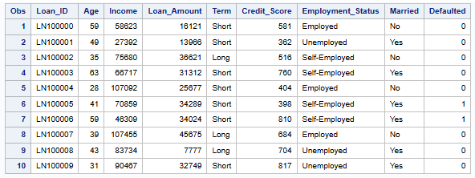
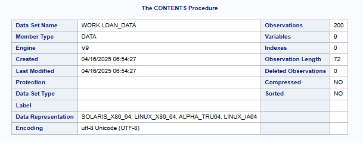
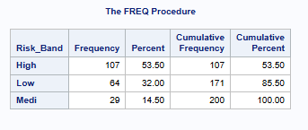
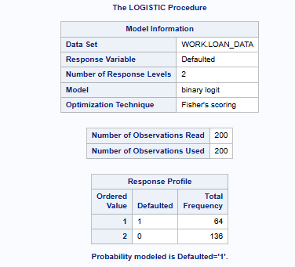
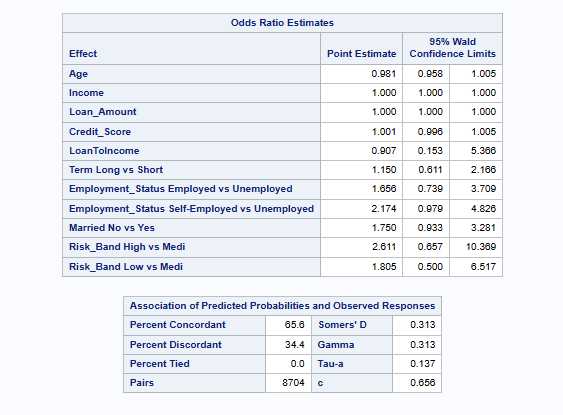

# 📊 Loan Default Risk Analysis (SAS Project)

This project uses **SAS OnDemand for Academics** to perform a full analysis of a loan dataset and identify key factors that contribute to loan default. It includes **data import**, **exploratory data analysis (EDA)**, **logistic regression modeling**, and **visualization** of risk trends.

---

## 🛠️ Tools & Technologies

- **SAS OnDemand for Academics**
- SAS Base Programming (PROC IMPORT, PROC MEANS, PROC FREQ, PROC LOGISTIC)
- SAS Visual Analytics (PROC SGPLOT)
- CSV Data Source: `loan_risk_data.csv`

---

## 📁 Project Structure

| Program | Description |
|--------|-------------|
| **Program 1** | Data Import & Exploratory Data Analysis |
| **Program 2** | Feature Engineering & Data Preparation |
| **Program 3** | Logistic Regression Modeling |
| **Program 4** | Model Evaluation, Insights, and Reporting |

---

## 🔍 Key Features

- Imported real-world-style loan data into SAS
- Performed summary statistics and categorical breakdowns
- Built correlation matrix for numerical fields
- Created bar charts to visualize default trends
- Trained a **logistic regression model** to predict loan defaults
- Evaluated model performance using accuracy, sensitivity, and specificity

---

## 📈 Business Impact

> Provides a decision-making foundation for financial institutions to assess **loan approval risk** based on demographic and financial data.

---

## 🧠 Skills Demonstrated

- Data Wrangling in SAS  
- Exploratory Data Analysis  
- Statistical Modeling (Logistic Regression)  
- Data Visualization  
- Predictive Analytics  

---

## 📸 Sample Output

>   
>   
>   
>   
>   
>   
>   
>   
>   
>   
> 

---

## 📎 How to Reproduce

1. Create an account at [SAS OnDemand for Academics](https://welcome.oda.sas.com/home)
2. Upload the `loan_risk_data.csv` file into your `Files(Home)` directory
3. Copy and paste each SAS program (Program 1 to Program 4) into SAS Studio
4. Run sequentially to replicate the full project

---

## 🔗 Author

**Yengkong Vang Sayaovong**  
📫 [LinkedIn](https://www.linkedin.com/in/ysayaovong)  
